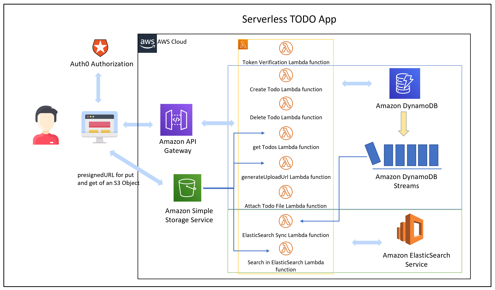
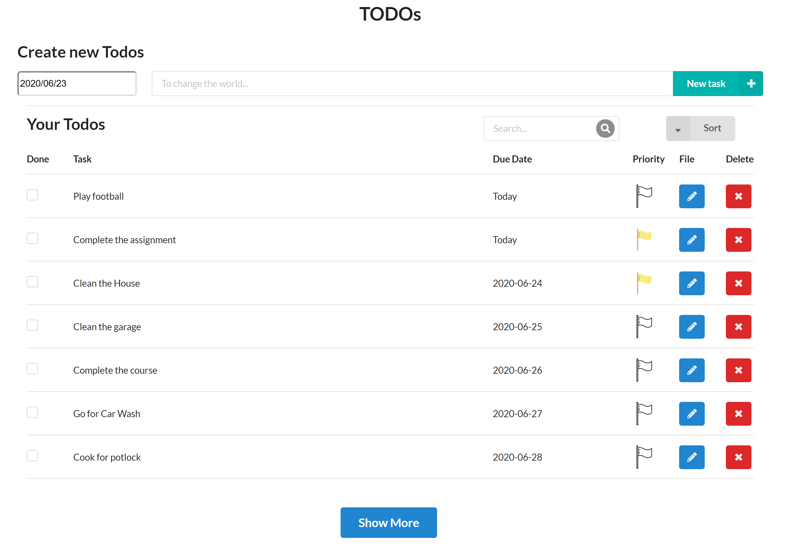
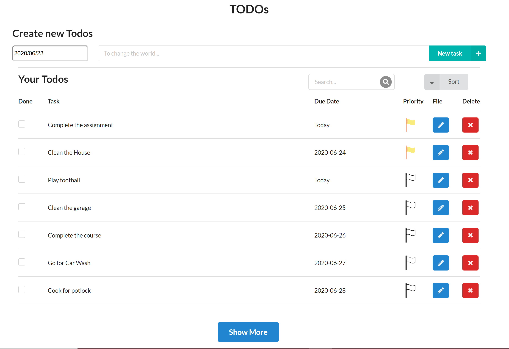
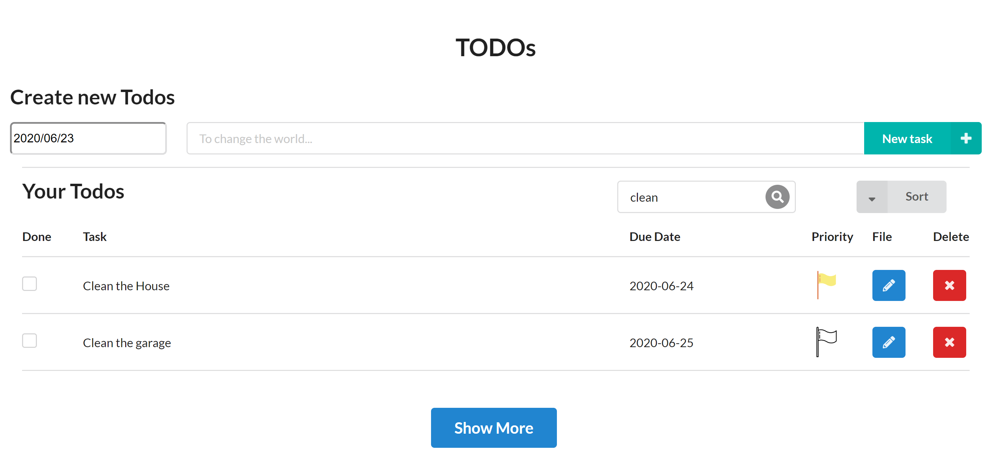

## Serverless TODO

To implement this project, you need to implement a simple TODO application using AWS Lambda and Serverless framework. Search for all comments starting with the `TODO:` in the code to find the placeholders that you need to implement.

## AWS Architecture of the application

<div align="center">

</div>

## Functionality of the application

This application will allow creating/removing/updating/fetching TODO items. Each TODO item can optionally have an attachment image. Each user only has access to TODO items that he/she has created. In order to see more todos that he/she created can be found by clicking the **Show More**. The user can give priority flag and sort the todos by priority. Finally, the user can search for the relevant todos using the search bar shown in the figure below.

Tasks:

<div align="center">

</div>

Tasks Sortby Priority:

<div align="center">

</div>

Tasks Search for **clean**:

<div align="center">

</div>

## TODO items

The application should store TODO items, and each TODO item contains the following fields:

- `userId` (string) - a unique id for the user
- `todoId` (string) - a unique id for an item
- `createdAt` (string) - date and time when an item was created
- `name` (string) - name of a TODO item (e.g. "Change a light bulb")
- `dueDate` (string) - date and time by which an item should be completed
- `done` (boolean) - true if an item was completed, false otherwise
- `attachmentUrl` (string) - a URL pointing to an image attached to a TODO item
- `pflag` (boolean) - a priority flag

## Functions to be implemented

To implement this project, you need to implement the following functions and configure them in the `serverless.yml` file:

- `Auth` - this function should implement a custom authorizer for API Gateway that should be added to all other functions.

- `GetTodos` - should return all TODOs for a current user. A user id can be extracted from a JWT token that is sent by the frontend

It should return data that looks like this:

```json
{
  "items": [
    {
      "todoId": "123",
      "createdAt": "2019-07-27T20:01:45.424Z",
      "name": "Buy milk",
      "dueDate": "2019-07-29T20:01:45.424Z",
      "done": false,
      "attachmentUrl": "http://example.com/image.png"
    },
    {
      "todoId": "456",
      "createdAt": "2019-07-27T20:01:45.424Z",
      "name": "Send a letter",
      "dueDate": "2019-07-29T20:01:45.424Z",
      "done": true,
      "attachmentUrl": "http://example.com/image.png"
    }
  ],
  "LastEvaluatedKey": "%7B%22todoId%22%3A%2230418d79-9c69-41ca-b635-17482b6dde27%22%2C%22userId%22%3A%225eee6317a55c1600134e06df%22%2C%22dueDate%22%3A%222020-06-23%22%7D"
}
```

Also, it sends the last evaluated key, to be resent when hit **Show More** to load more todos.

- `CreateTodo` - should create a new TODO for a current user. A shape of data send by a client application to this function can be found in the `CreateTodoRequest.ts` file

It receives a new TODO item to be created in JSON format that looks like this:

```json
{
  "createdAt": "2019-07-27T20:01:45.424Z",
  "name": "Buy milk",
  "dueDate": "2019-07-29T20:01:45.424Z",
  "done": false,
  "pflag": false,
  "attachmentUrl": "http://example.com/image.png"
}
```

It should return a new TODO item that looks like this:

```json
{
  "item": {
    "todoId": "123",
    "createdAt": "2019-07-27T20:01:45.424Z",
    "name": "Buy milk",
    "dueDate": "2019-07-29T20:01:45.424Z",
    "done": false,
    "pflag": false,
    "attachmentUrl": "http://example.com/image.png"
  }
}
```

- `UpdateTodo` - should update a TODO item created by a current user. A shape of data send by a client application to this function can be found in the `UpdateTodoRequest.ts` file

It receives an object that contains three fields that can be updated in a TODO item:

```json
{
  "name": "Buy bread",
  "dueDate": "2019-07-29T20:01:45.424Z",
  "done": true,
  "pflag": false
}
```

The id of an item that should be updated is passed as a URL parameter.

It should return an empty body.

- `DeleteTodo` - should delete a TODO item created by a current user. Expects an id of a TODO item to remove.

It should return an empty body.

- `GenerateUploadUrl` - returns a pre-signed URL that can be used to upload an attachment file for a TODO item.

It should return a JSON object that looks like this:

```json
{
  "uploadUrl": "https://s3-bucket-name.s3.eu-west-2.amazonaws.com/image.png"
}
```

- `attachTodoFile` - Updating the dynamoDB with the uploaded S3 file object.

- `ElasticSearch Sync` - This will be triggered by the DynamoDB events and responsible to keep the two databases in sync.

- `Search in ElasticSearch` - When the searched for specific todo, the search query is directed to ElasticSearch and the relevant todo items are retrieved.

All functions are already connected to appropriate events from API Gateway.

An id of a user can be extracted from a JWT token passed by a client.

## Frontend

The `client` folder contains a web application that can use the API that should be developed in the project.

## Authentication

## Best practices

To complete this exercise, please follow the best practices from the 6th lesson of this course.

### Logging

The starter code comes with a configured [Winston](https://github.com/winstonjs/winston) logger that creates [JSON formatted](https://stackify.com/what-is-structured-logging-and-why-developers-need-it/) log statements. You can use it to write log messages like this:

```ts
import { createLogger } from '../../utils/logger'
const logger = createLogger('auth')

// You can provide additional information with every log statement
// This information can then be used to search for log statements in a log storage system
logger.info('User was authorized', {
  // Additional information stored with a log statement
  key: 'value'
})
```

## How to run the application

### Backend

To deploy an application run the following commands:

```
cd backend
npm install
sls deploy -v
```

### Frontend

To run a client application first edit the `client/src/config.ts` file to set correct parameters. And then run the following commands:

```
cd client
npm install
npm run start
```

This should start a development server with the React application that will interact with the serverless TODO application.

## Postman collection

An alternative way to test your API, you can use the Postman collection that contains sample requests. You can find a Postman collection in this project.

Set the apiID:

**{{apiId}}**
